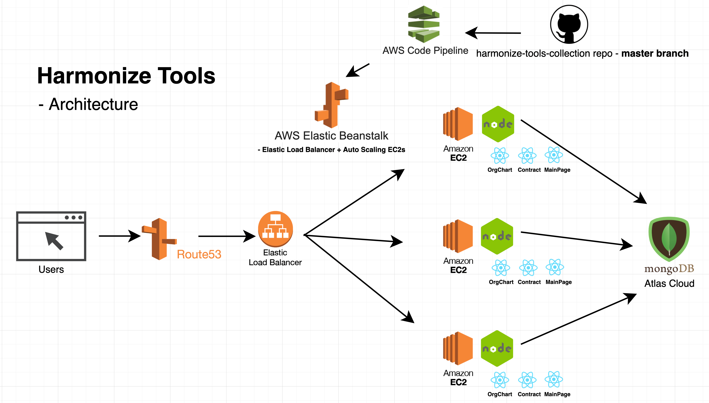

# Harmonize Tools Collection

Harmonize tools collection is a collection of web apps that assist with daily mundane HR tasks. Currently includes Organizational Chart Tool, Contract Generator Tool, and Tax Calculator Tool.

###### Please note "Team Contribution" section before making any contribution.

## Installation / Collection overview

At root directory, use npm / yarn:

```bash
npm run install   # install dependencies for nodejs server and 3 react apps
npm run build   # build static files for the 3 react apps
npm start   # start up development server - http://localhost:5000
```

## Working on a specific frontend

At root directory, use npm / yarn:

```bash
git checkout -b <your-branch-name>   # work on your own branch
cd server && nodemon app.js   # Start up server (if working on / with api)

# Open another terminal
npm start --prefix clients/<your-client-name> # Work on your react app - http://localhost:3000
```

## Project Architecture



## Team Contribution \*\*\*

Master branch is for production CI / CD, it's connected to AWS CodePipeline & Elastic Beanstalk. Please test your new feature / changes before integrating them to master.

## License

[MIT](https://choosealicense.com/licenses/mit/)
